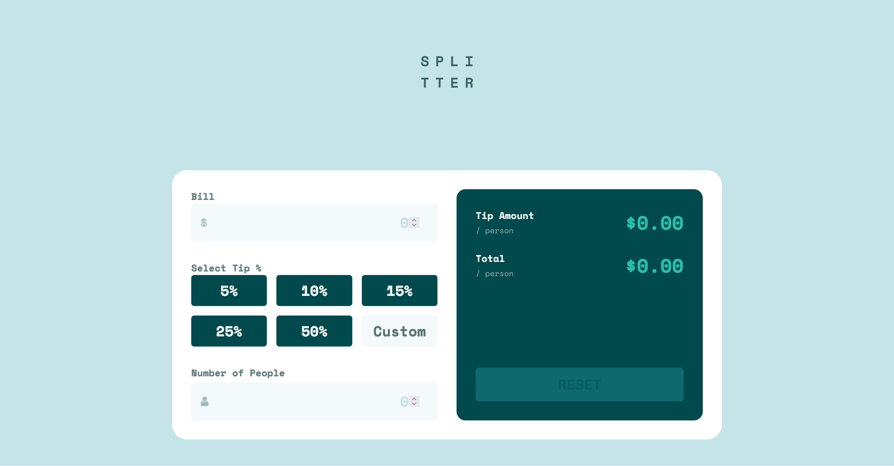

# Frontend Mentor - Tip calculator app solution

This is a solution to the [Tip calculator app challenge on Frontend Mentor](https://www.frontendmentor.io/challenges/tip-calculator-app-ugJNGbJUX). Frontend Mentor challenges help you improve your coding skills by building realistic projects.

## Table of contents

- [Overview](#overview)
  - [The challenge](#the-challenge)
  - [Screenshot](#screenshot)
  - [Links](#links)
- [My process](#my-process)
  - [Built with](#built-with)
  - [What I learned](#what-i-learned)
  - [Continued development](#continued-development)
- [Author](#author)

## Overview

### The challenge

Users should be able to:

- View the optimal layout for the app depending on their device's screen size
- See hover states for all interactive elements on the page
- Calculate the correct tip and total cost of the bill per person

### Screenshot

### Links

- Solution URL: [https://www.frontendmentor.io/solutions/tip-calculator-app-using-grid-and-javascript-Wxuy7nXuhT]
- Live Site URL: [https://rainbowsurfer137.github.io/tip-calculator-app/]

## My process

### Built with

- Semantic HTML5 markup
- CSS custom properties
- Flexbox
- CSS Grid

### What I learned

Working on this tip calculator taught me a lot! I really solidified my understanding of how to use CSS Grid and Flexbox to build responsive layouts. 

### Continued development

UI want to keep improving my JavaScript skills, especially around DOM manipulation and form validation. I’d also like to get more comfortable writing cleaner, reusable code and structuring larger projects. 

## Author

- Frontend Mentor - [@rainbowsurfer137](https://www.frontendmentor.io/profile/rainbowsurfer137)
